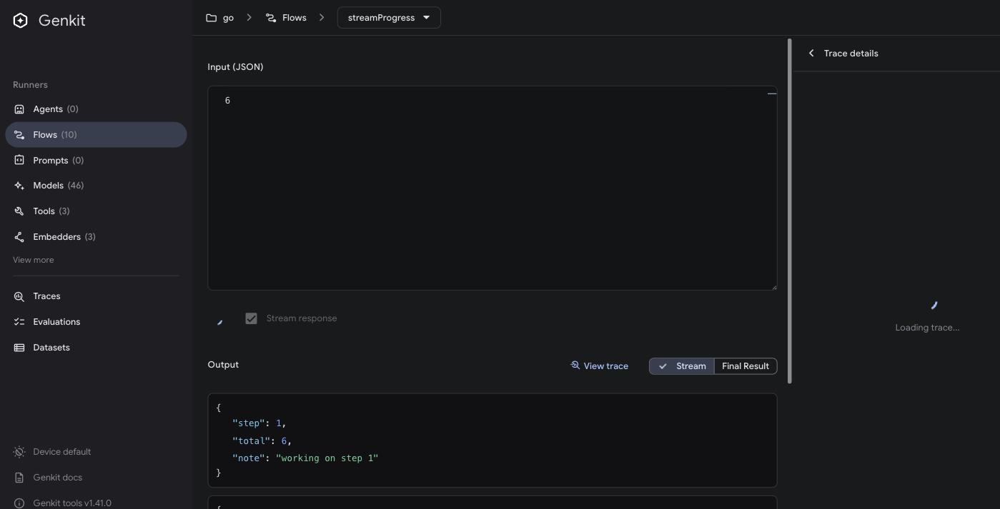
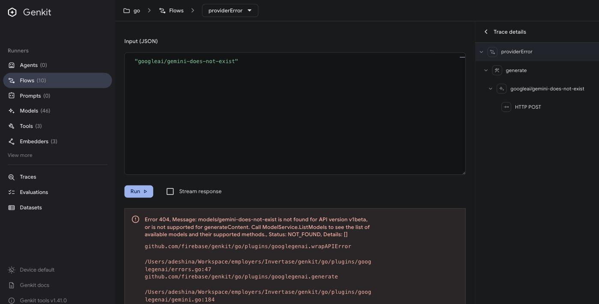
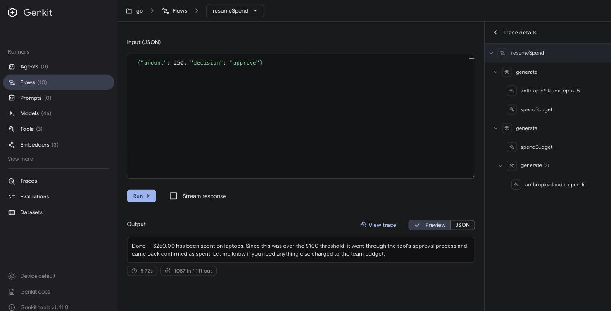
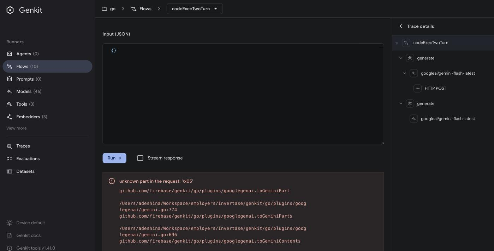
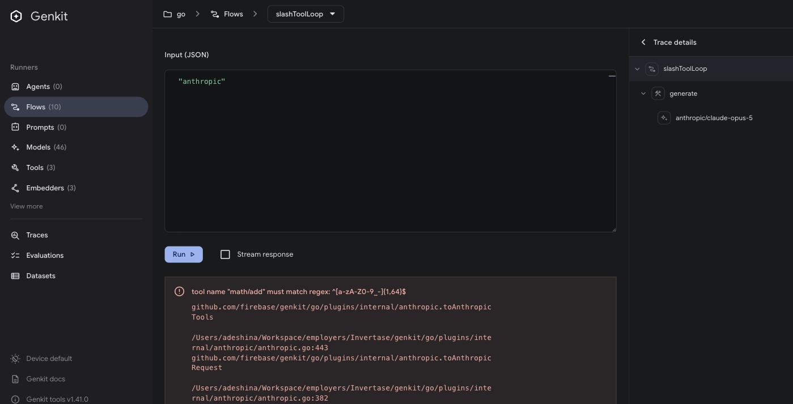
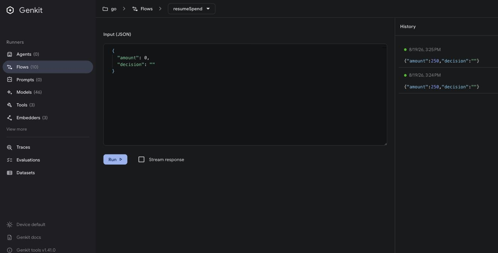

# Dev UI x Go SDK - Flows and tools

Setup: Dev UI (genkit-tools 1.41.0, built from this checkout) on :4000, Go
runtime `go/samples/dev-ui-qa` on :3100. Models: `anthropic/claude-opus-5` for
the tool loop and interrupts, `googleai/gemini-flash-latest` for code execution.
Run on 2026-08-19.

`flows.go` was an empty TODO stub, so the flows and tools below were written for
this run.

| # | Case | Result |
| --- | --- | --- |
| 1a | Streaming chunks render | Pass |
| 1b | Error flow shows a classified provider error | Partial - message and stack show, status does not |
| 2 | Interrupt, then resume from the UI | Partial - works in code, no UI control for it |
| 3 | Multi-turn code execution breaks turn 2 (GGA-4) | Reproduced |
| 4 | Tool name with `/` hard-fails (GGA-25) | Reproduced, also affects anthropic |

## 1a. Streaming chunks (`streamProgress`)

Works. Chunks appear as they arrive, with a Stream / Final Result toggle, and
the final output replaces them. 6 steps at 300ms measured 1.81s.



## 1b. Classified provider error (`providerError`, `failingFlow`)

The error banner shows the provider message plus the Go stack, and the trace
tree still renders the failed spans. But the status never makes it to the
screen.

| Case | Status | `code` on the wire | Shown in UI |
| --- | --- | --- | --- |
| unknown model | NOT_FOUND | 5 | message + stack |
| `core.NewError(INVALID_ARGUMENT)` | INVALID_ARGUMENT | 3 | message + stack |
| `core.NewPublicError(UNAUTHENTICATED)` | UNAUTHENTICATED | 16 | `UNAUTHENTICATED: ...` |
| bare `fmt.Errorf` | INTERNAL | 13 | message |

The one case that shows a status only does so because `NewPublicError` puts it
in the message string. So a provider 404, a bad argument and an internal panic
all look the same in the UI.

Two more things from the same responses:

- `details` only carries `stack` and `traceId`. The details map passed to
  `NewPublicError` (`{"provider": "fake"}`) is not delivered.
- Error wrapping in flow code is lost. `codeExecTwoTurn` wraps its turn-2 error
  with `fmt.Errorf("turn 2 (...): %w", err)` and only the inner message comes
  back.



## 2. Interrupt, then resume (`resumeSpend`)

The SDK side works:

- `decision: ""` - tool interrupts, flow reports `paused: 1 interrupt(s)`.
  Trace: `generate` -> `spendBudget`.
- `decision: "approve"` - `RestartWith` re-runs the tool, model finishes.
  Trace: `generate` -> `spendBudget`, `generate` -> `spendBudget`,
  `generate (2)` -> model.
- `decision: "deny"` - takes the `RespondWith` path.

The UI has nothing for this. An interrupt is just text in the output box: no
pending-interrupt state, no approve/restart control, no way to send
`ToolRestarts` or `ToolResponses` back. Resume only worked here because the flow
takes the decision as input and re-runs from the start. A flow holding interrupt
state in memory cannot be resumed from the Dev UI.

Running the tool directly at `/tools/spendBudget` shows
`tool execution interrupted: { "amount": 250, "reason": "approval_required" }`
as an error.



## 3. Multi-turn code execution - GGA-4 reproduced

`codeExecTwoTurn` runs code execution, then replays `first.History()` into a
second turn. Turn 1 is fine. Turn 2 fails before any HTTP call (its `generate`
span has no HTTP child):

```
unknown part in the request: '\x05'
  googlegenai.toGeminiPart      plugins/googlegenai/gemini.go:774
  googlegenai.toGeminiParts     plugins/googlegenai/gemini.go:696
  googlegenai.toGeminiContents  plugins/googlegenai/gemini.go:335
```

`\x05` is `PartCustom` (`ai/document.go:84`). The plugin produces custom parts
for `executableCode` and `codeExecutionResult` on turn 1, and its own converter
rejects them on turn 2. `toGeminiPart`'s default branch needs cases for them -
`GetExecutableCode` / `GetCodeExecutionResult` already read the same shape.



## 4. Tool name with `/` - GGA-25 reproduced

Client-side rejection during conversion, confirmed. It is not only googleai:

| Backend | Message | Site |
| --- | --- | --- |
| googleai | `invalid tool name: "math/add", must start with a letter or an underscore, ...` | `plugins/googlegenai/tools.go:29` |
| anthropic | `tool name "math/add" must match regex: ^[a-zA-Z0-9_-]{1,64}$` | `plugins/internal/anthropic/anthropic.go:443` |

Nothing warns you before that point. `DefineTool(g, "math/add", ...)` registers
fine, the Dev UI lists it, routes to `/tools/math/add` despite the slash, and
runs it (`{"a": 2, "b": 40}` -> `{"output": 42}`). It only breaks once a model
is involved, and it takes down the whole `Generate` call including the
validly-named tools in it. Validating the name in `DefineTool` would move this
to startup.



## Other things noticed

- **Runner input gets wiped after load.** For about 5-9s after opening a flow
  page, the input editor is re-seeded from the schema. Anything typed in that
  window is lost, and a Run clicked there still executes (it shows in History)
  but its output never renders. Seen on 6 flow pages. After it settles, input
  stays put (checked idle for 20s).
  
- **Each action-list refresh writes a trace.** Every `listActions` makes the
  googleai plugin call `GET generativelanguage.googleapis.com/v1beta/models`,
  and that span is exported as its own root trace. 3 calls produced 3 `HTTP GET`
  traces with no input, output or tokens; idle produced none in 60s. Navigating
  the UI fills the Traces list with them. The model count also moves between
  refreshes (46 -> 47).
- **Tool output is wrapped.** Go registers tools as `/tool.v2/<name>` and the
  runner shows `{"output": 42}` instead of the declared return value. The UI
  handles `tool.v2` fine otherwise.
- **`gemini-2.5-flash` is retired for this key** (404, "no longer available to
  new users, use models/gemini-3.6-flash"). The plugin still lists it as a
  curated model, so it shows up in the UI and fails on use.

## Running it again

Two shells, both starting from the repo root. `$R` avoids relative-path
surprises - `cd $(git rev-parse --show-toplevel)` sets it from anywhere in the
repo.

Shell 1, the Go runtime (this blocks):

```bash
R=$(git rev-parse --show-toplevel)
cd "$R/go/samples/dev-ui-qa"
GENKIT_ENV=dev go run .
```

Shell 2, the Dev UI on :4000:

```bash
R=$(git rev-parse --show-toplevel)
cd "$R/go"
node "$R/genkit-tools/cli/dist/bin/genkit.js" ui:start
```

The UI has to start from somewhere under `go/` - that is the project root it
scans for runtimes (`go/.genkit/runtimes`). Stop it with `genkit ui:stop`.

If `dist/bin/genkit.js` is missing, build the CLI first (pnpm 10, via corepack
if it is not on PATH):

```bash
cd "$R/genkit-tools" && pnpm build
```

Needs `ANTHROPIC_API_KEY`, plus `GEMINI_API_KEY` or `GOOGLE_API_KEY` for the
code execution case. Flows: `streamProgress`, `providerError`, `failingFlow`,
`resumeSpend`, `codeExecTwoTurn`, `slashToolLoop`, `toolLoop`, `triageTicket`,
`interruptedSpend`, `smoke`.
