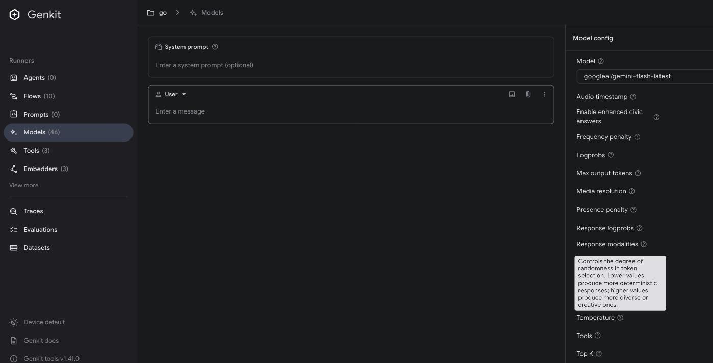
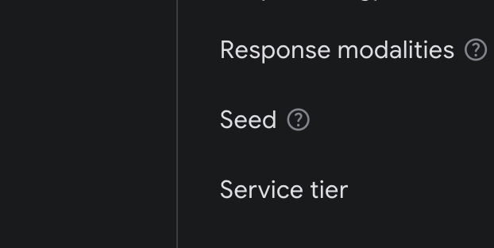
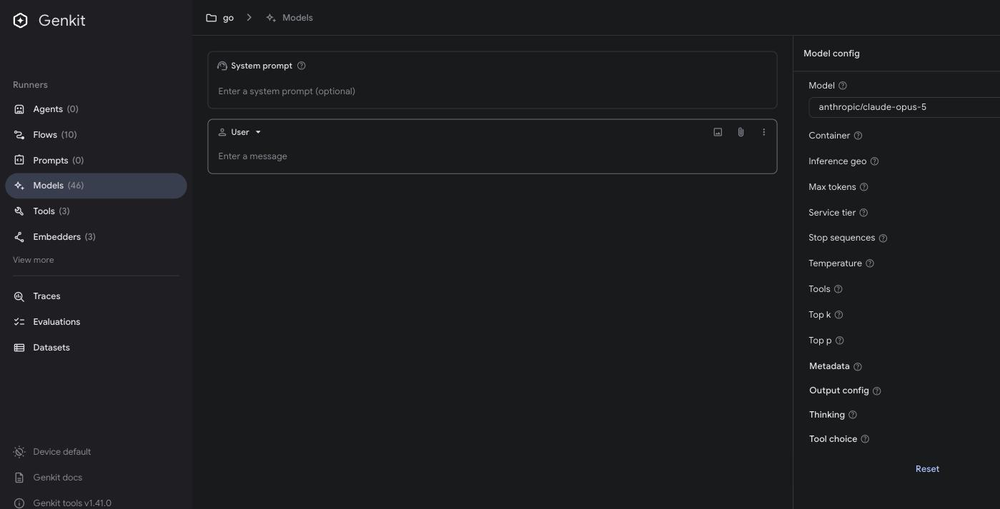

# Dev UI x Go SDK - Model runner, config editor

Same rig as the flows-and-tools run: Dev UI 1.41.0 on :4000, Go runtime
`go/samples/dev-ui-qa` on :3100, models `anthropic/claude-opus-5` and
`googleai/gemini-flash-latest`. Run on 2026-08-19.

Schema numbers come from `/api/actions` (`metadata.model.customOptions`).
Runtime cases were sent through `/api/runAction`, the same path the config
editor uses. Decode behaviour is reproducible with
`go test ./samples/dev-ui-qa -run TestConfigDecodeProbe -v`.

| Case | Result |
| --- | --- |
| Config descriptions render | Pass |
| serviceTier has no description (GGA-50) | Reproduced, googleai only |
| No backend caveats (ANT-54, GGA-34) | Mostly true - 4 googleai props mention one, anthropic none |
| No value constraints (ANT-25) | Confirmed, and bad values do reach the API |
| `thinking.adaptive` discarded, typo validates and vanishes (ANT-9) | Reproduced |
| Server-side tools via config rejected as custom tools (ANT-10) | Reproduced |
| String-form system dropped (ANT-15) | Reproduced |
| httpOptions timeout unit (GGA-2) | Reproduced - documented ms, consumed as ns |
| `config.version` rejected by closed schema (ANT-49) | Reproduced, both plugins |

## Descriptions, serviceTier, backend caveats

Descriptions do render. Each field gets a help icon and the description shows on
hover.



googleai has 32 top-level config properties. `serviceTier` is the only one with
no description, and in the editor it is the only field with no help icon at all.



It is also unvalidated: `{"serviceTier": "not-a-tier"}` goes through to the
provider, which returns
`Invalid value at 'service_tier' ... "not-a-tier"`.

Anthropic is not affected - its `service_tier` is documented, and every field in
that editor has a help icon.



Backend caveats are thinner than "none". Scanning every described node in both
schemas:

| Plugin | Described nodes | Mentioning a backend limit |
| --- | --- | --- |
| googleai | 58 | 4 |
| anthropic | 16 | 0 |

The googleai four are `enableEnhancedCivicAnswers` ("Not available in Vertex
AI"), `httpOptions.baseUrlResourceScope` and `safetySettings[].method` ("Vertex
AI only"), and `routingConfig`. So the pattern exists but is applied to a
handful of fields; nothing marks which options are ignored per model, and
anthropic has none at all.

Seven googleai properties are bare `true` schemas with no type and no
description: `cachedContent`, `candidateCount`, `responseJsonSchema`,
`responseMimeType`, `responseSchema`, `systemInstruction`. Anthropic has three
(`messages`, `model`, `system`) - those are the deliberately hidden managed
fields, kept permissive so they reach the guard in `rejectManagedConfig`
(`plugins/internal/anthropic/anthropic.go:191`) instead of failing validation.

## ANT-25 - no value constraints

No numeric field in either schema carries `minimum`, `maximum`, `enum` or
`multipleOf`. `temperature`, `topP`/`top_p`, `topK`/`top_k`,
`maxOutputTokens`/`max_tokens`, `seed` and `logprobs` all reflect as bare
`{"type": "number"}` or `{"type": "integer"}`.

Bad values are not caught anywhere on the way out - the provider catches them:

| Config | Result |
| --- | --- |
| anthropic `{"temperature": 50}` | 400 from `api.anthropic.com` |
| anthropic `{"top_p": 9}` | 400 from `api.anthropic.com` |
| googleai `{"temperature": 50}` | `temperature must be in the range [0.0, 2.0]` |
| googleai `{"topP": 9}` | `top_p must be in the range [0.0, 1.0]` |

## ANT-9 - thinking.adaptive is discarded

`{"thinking": {"type": "adaptive"}}` passes validation, produces no error, and
has no effect. Same prompt, three runs each:

| Config | Response parts | Output tokens |
| --- | --- | --- |
| none | reasoning + text | 12 |
| `{"thinking":{"type":"adaptive"}}` | reasoning + text | 12 |
| `{"thinking":{"type":"disabled"}}` | text | 3 |

`disabled` takes effect, `adaptive` is indistinguishable from sending nothing.
The decode probe shows why - `adaptive` never lands in the union:

```
in={"thinking":{"type":"adaptive"}}   thinking(en/dis/ad)=false/false/false  remarshal={"max_tokens":0}
in={"thinking":{"type":"adaptiv"}}    thinking(en/dis/ad)=false/false/false  remarshal={"max_tokens":0}
in={"thinking":{"type":"disabled"}}   thinking(en/dis/ad)=false/true/false   remarshal={"max_tokens":0,"thinking":{"type":"disabled"}}
in={"thinking":{"type":"enabled",...} thinking(en/dis/ad)=true/false/false   remarshal={...,"thinking":{"budget_tokens":2048,"type":"enabled"}}
```

`enabled` and `disabled` decode into `ThinkingConfigParamUnion`; `adaptive` does
not, so the field is gone before the request is built. A typo'd discriminator
(`"adaptiv"`) behaves identically - the advertised schema for `thinking` is a
plain object, so nothing rejects it and nothing applies it.

Worth noting for Claude Opus 5 specifically: thinking is on by default, so
"adaptive was dropped" and "adaptive was applied" look the same in the output.
The `disabled` row is what makes the difference visible.

## ANT-10 - server-side tools misrouted

```json
{"tools": [{"type": "web_search_20260209", "name": "web_search"}]}
```

```
custom function tools must be set using Genkit feature: ai.WithTools();
the config-level tools field is reserved for server-side tools (web search, code execution, etc.)
```

The value passed is a server-side web search tool, which is exactly what the
message says the field is for. Same error with the older
`web_search_20250305` type.

The cause is decoding, not the guard. A server tool JSON lands in the union's
custom-tool variant (`OfTool`), and the guard at
`plugins/internal/anthropic/anthropic.go:203` rejects anything with `OfTool`
set. From the probe:

```
in={"tools":[{"type":"web_search_20260209","name":"web_search"}]}  tools=1 ofTool=true
```

The data itself survives the round trip (it re-marshals unchanged), so the
classification is the only thing wrong.

## ANT-15 - string-form system dropped

`{"system": "You must answer with the single word BANANA."}` returns a normal
answer, no error, no BANANA. The string form decodes to zero system blocks, so
it never reaches the guard that is supposed to catch it:

```
in={"system":"be terse"}                          system=0   remarshal={"max_tokens":0}
in={"system":[{"type":"text","text":"be terse"}]} system=1   remarshal={...,"system":[{"text":"be terse","type":"text"}]}
```

The array form decodes and does hit the guard:
`system prompt must be set using Genkit feature: ai.WithSystem()`. So the two
spellings of the same field behave differently - one is refused with a useful
message, the other disappears.

## GGA-2 - httpOptions timeout unit

The schema says `"Per-request timeout in milliseconds."` The value is consumed
as a Go duration (nanoseconds):

| Config | Result |
| --- | --- |
| `{"httpOptions":{"timeout":5000}}` | `context deadline exceeded` (5000ns = 5µs) |
| `{"httpOptions":{"timeout":1}}` | `context deadline exceeded` |
| `{"httpOptions":{"timeout":2000000000}}` | succeeds (2s) |
| `{"httpOptions":{"timeout":5000000000}}` | succeeds (5s) |

Not discarded here - a caller following the documented unit gets a request that
always fails, and the error says nothing about the timeout being theirs.

## ANT-49 - config.version rejected

```json
{"version": "claude-opus-4-8"}
```

```
invalid input to action "/model/anthropic/claude-opus-5": data did not match expected schema:
- config: Must validate at least one schema (anyOf)
- config: Additional property version is not allowed
```

Same on googleai with `{"version": "gemini-3.5-flash"}`. Both config schemas set
`additionalProperties: false`, so the field is refused before the request is
built.

## Reproducing

Runtime is the same as the flows-and-tools run (see `../flows-and-tools/results.md`).
Config cases go straight to the model action:

```bash
curl -s localhost:4000/api/runAction -H 'Content-Type: application/json' -d '{
  "key": "/model/anthropic/claude-opus-5",
  "input": {"messages":[{"role":"user","content":[{"text":"Say OK."}]}],
            "config":{"thinking":{"type":"adaptive"}}}
}'
```

Decode behaviour:

```bash
go test ./samples/dev-ui-qa -run TestConfigDecodeProbe -v
```
